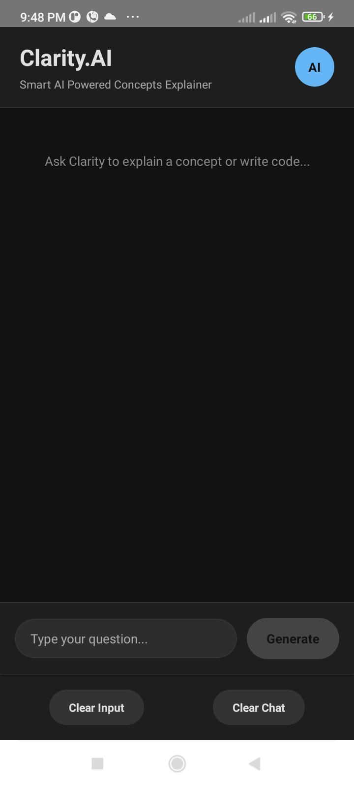
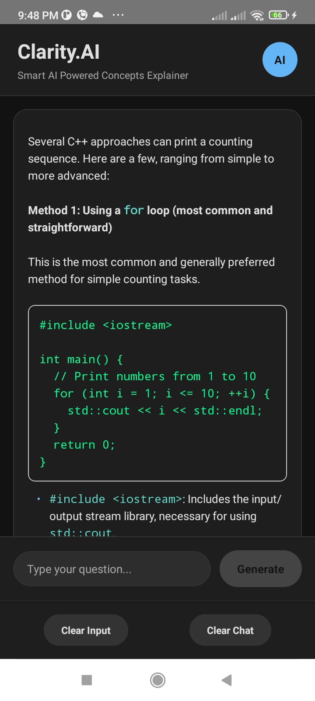

# Clarity.AI

Clarity.AI is a mobile application built with React Native CLI that serves as an AI-powered coding and study assistant. It delivers clear explanations of programming concepts and generates code snippets using the Gemini 1.5 Flash API.

## Features

* **AI-Powered Assistance**: Get detailed and accurate answers to coding and study questions.
* **Markdown Support**: View responses with rich formatting, code blocks, and lists.
* **Modern Dark UI**: Sleek, user-friendly interface.
* **Cross-Platform**: Works seamlessly on both iOS and Android.

## Installation

1. Clone the repository:

   `git clone https://github.com/Ridam-Mittal/Clarity.AI.git`
   `cd Clarity.AI`

2. Install dependencies:

   `npm install`

3. Create a `.env` file and add your Gemini API key:

   ``
   GEMINI_API_KEY="your_api_key_here"
   ``

4. Run the app:

   `npx react-native run-android`

   or

   `npx react-native run-ios`

## Tech Stack

* React Native CLI
* Google Generative AI SDK
* react-native-markdown-display

### Screenshots

  
  &nbsp;&nbsp;&nbsp;
  

